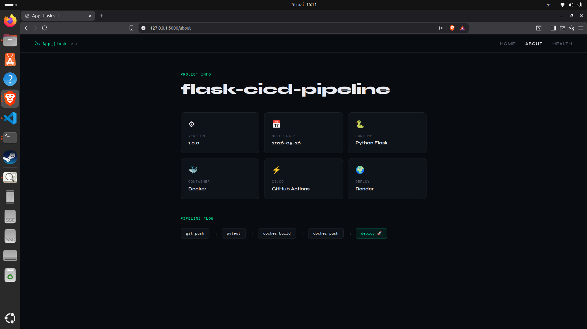
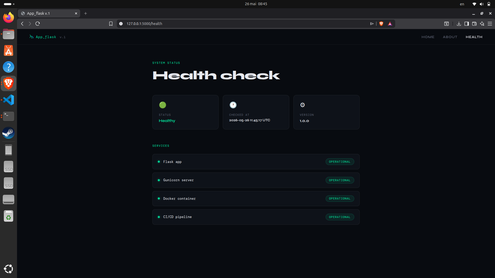

# Flask CI/CD Pipeline — Application Flask avec déploiement automatisé

Application web développée avec Flask intégrant une pipeline CI/CD complète avec Docker, GitHub Actions et déploiement automatique sur Render via Deploy Hook

---


# Table des matières

- Présentation
- Stack technique
- Prérequis
- Installation
- Configuration
- Lancer l'application
- Exécution avec Docker
- Tests
- Pipeline CI/CD
- Secrets GitHub Actions
- Endpoints
- Architecture du projet
- Résolution de problèmes connus

---

## Présentation

**App_flask v.1** est une application Flask minimaliste conçue pour démontrer un workflow DevOps moderne avec automatisation complète du déploiement.


Chaque `git push` sur la branche `main` déclenche automatiquement :

- Les tests avec **pytest**
- Le build de l'image **Docker**
- Le push sur **Docker Hub**
- Le déploiement automatique sur **Render** via Deploy Hook

```
git push → pytest → docker build → docker push → Render deploy 
```

---
# Screenshots

## Home


## About


## Health


---

---

## Stack technique

| Couche | Technologie | Version |
|---|---|---|
| Backend | Python | 3.11 |
| Framework | Flask | 3.0 |
| Variables d'environnement | python-dotenv | 1.0 |
| Serveur WSGI | Gunicorn | 21.2 |
| Tests | pytest | 8.0 |
| Conteneurisation | Docker | latest |
| CI/CD | GitHub Actions | latest |
| Registry Docker | Docker Hub | — |
| Hébergement | Render (gratuit) | — |

---

## Prérequis

- Python >= 3.11
- pip >= 25.x
- Git
- Docker
- Un compte [Docker Hub](https://hub.docker.com)
- Un compte [Render](https://render.com) (gratuit)

Testé sur Ubuntu 25.04 avec Python 3.13.

---

## Installation

### 1. Cloner le projet

```bash
git clone https://github.com/AndriamamonjyFah/flask-cicd-pipeline.git
cd flask-cicd-pipeline
```

### 2. Créer un environnement virtuel

```bash
python3 -m venv venv
```

### 3. Activer l'environnement virtuel

**Linux / macOS**
```bash
source venv/bin/activate
```

**Windows**
```bash
venv\Scripts\activate
```

### 4. Installer les dépendances

```bash
pip install -r requirements.txt
```

---

## Configuration

Créer un fichier `.env` à la racine du projet :

```env
APP_NAME=App_flask
APP_VERSION=1.0
BUILD_DATE=2026-05-26
```

---

## Lancer l'application

```bash
flask --app app:create_app run
```

Application accessible sur `http://127.0.0.1:5000`

---

## Exécution avec Docker

### Build de l'image

```bash
docker build -t fahrendren/flask-app:latest .
```

### Lancer le container

```bash
docker run -p 5000:5000 fahrendren/flask-app:latest
```

### Push sur Docker Hub

```bash
docker login -u fahrendren
docker push fahrendren/flask-app:latest
```

Application accessible sur `http://localhost:5000`

---

## Tests

```bash
pytest tests/ -v
```

---

## Pipeline CI/CD

Le workflow GitHub Actions (`.github/workflows/ci-cd.yml`) effectue automatiquement :

1. Installation des dépendances Python
2. Exécution des tests **pytest**
3. Build de l'image Docker
4. Push sur **Docker Hub**
5. Déclenchement du déploiement sur **Render** via Deploy Hook

```
Push vers main
      │
      ▼
┌─────────┐
│  Tests  │
│ pytest  │
└────┬────┘
     │  pass
     ▼
┌──────────────┐
│ Docker Build │
│  + Hub Push  │
└──────┬───────┘
       │  pushed
       ▼
┌──────────────────┐
│  Render Deploy   │
│  via Webhook     │
└──────────────────┘
```

> Le job `deploy` s'exécute uniquement sur la branche `main` après validation des tests.

---

## Secrets GitHub Actions

Dans le dépôt GitHub → **Settings → Secrets and variables → Actions** :

| Secret | Description |
|---|---|
| `DOCKERHUB_USERNAME` | Nom d'utilisateur Docker Hub |
| `DOCKERHUB_TOKEN` | Token d'accès Docker Hub (Read & Write) |
| `RENDER_DEPLOY_HOOK` | URL du Deploy Hook Render |

---

## Déploiement sur Render

### 1. Créer le service

1. Aller sur [render.com](https://render.com) → **New → Web Service**
2. Choisir **Deploy an existing image**
3. Image URL : `docker.io/fahrendren/flask-app:latest`
4. Name : `flask-app` · Region : `Frankfurt` · Plan : **Free**
5. Cliquer **Create Web Service**

### 2. Récupérer le Deploy Hook

Dans le service Render → **Settings → Deploy Hook** → copier l'URL.

### 3. Ajouter le secret GitHub

| Secret | Valeur |
|---|---|
| `RENDER_DEPLOY_HOOK` | URL copiée depuis Render |

### 4. Variables d'environnement sur Render

Dans le service Render → **Environment** → ajouter :

| Key | Value |
|---|---|
| `APP_NAME` | App_flask |
| `APP_VERSION` | 1.0 |
| `BUILD_DATE` | 2026-05-26 |

>  Le plan gratuit Render met l'app en veille après 15 min d'inactivité. Le premier chargement peut prendre ~30 secondes.

---

## Endpoints

| Route | Description |
|---|---|
| `GET /` | Page d'accueil avec terminal CI/CD animé |
| `GET /about` | Informations du projet (version, build date, stack) |
| `GET /health` | État des services en temps réel |

---

## Architecture du projet

```
flask-cicd-pipeline/
├── app/
│   ├── __init__.py          # App factory + config dotenv
│   ├── routes.py            # Routes : / /about /health
│   ├── templates/
│   │   ├── base.html        # Layout commun + navigation
│   │   ├── index.html       # Page d'accueil + terminal animé
│   │   ├── about.html       # Infos projet + pipeline
│   │   └── health.html      # Statut des services
│   └── static/
│       ├── css/style.css    # Design sombre, Syne + DM Mono
│       └── js/main.js       # Animations : typing, terminal, scroll
├── tests/
│   └── test_app.py
├── .github/
│   └── workflows/
│       └── ci-cd.yml        # Pipeline : test → build → render deploy
├── docs/
│   ├── preview.mp4
│   ├── home.png
│   └── about.png
├── render.yaml              # Config déploiement Render
├── Dockerfile
├── requirements.txt
├── .env
└── README.md
```

---

## Résolution de problèmes connus

### `externally-managed-environment`

Ubuntu récent bloque les installations pip globales.

```bash
python3 -m venv venv
source venv/bin/activate
pip install -r requirements.txt
```

### `flask command not found`

```bash
pip install flask
```

### `Could not import 'app.app'`

Depuis la racine du projet :

```bash
flask --app app:create_app run
```

### Port 5000 déjà utilisé

```bash
sudo lsof -i :5000
kill -9 PID
```

### L'app Render ne démarre pas

Vérifier les **Logs** dans le dashboard Render. Cause fréquente : variables d'environnement manquantes ou image Docker non trouvée sur Docker Hub.

---

<div align="center">

Développé avec Flask · Docker · GitHub Actions · Render

</div>
